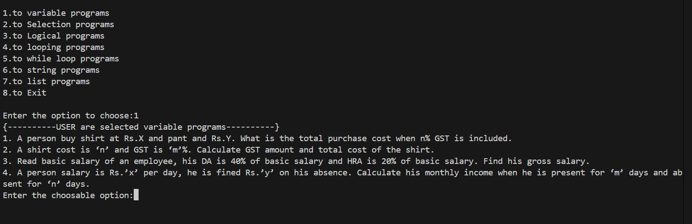
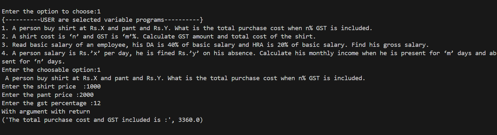
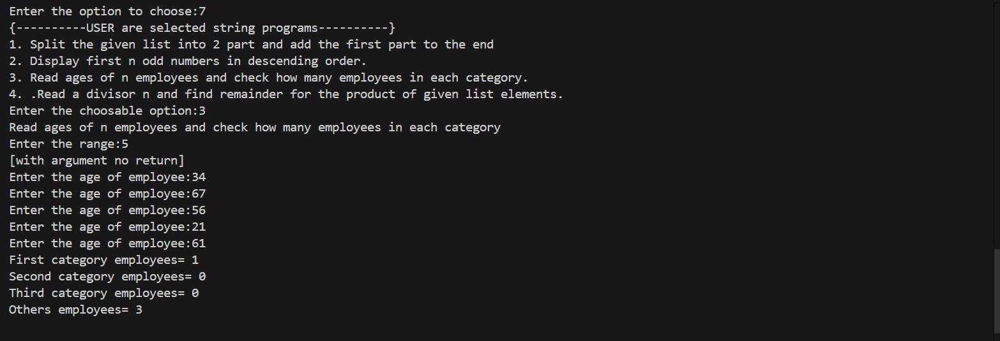
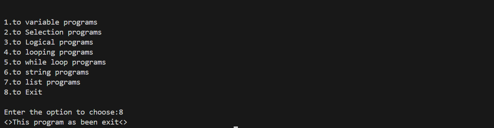

# Python Program Collection 
 ↖️ This repository contains various Python programs and demonstrating fundamental concepts

## 📍Topics Implement 
- variable programs
- Selection programs
- Logical programs
- looping programs
- while loop programs
- string programs
- list programs
## Requirement 
- Python installation

## ♾️ Functions to Provided 
This programs also include function implementations into four types: 
1. With Argument, With Return 
👉🏼 Functions that take parameters and return a value 
- Example:
```bash
    def add(a, b):
        return a + b
    result = add(5, 10)
    print(result)  # Output: 15
```
2. No Argument, With Return
👉🏼 Fuctions that do not take parameters but return a value.
- Example:
```bash
    def greet():
        return "Hello, World!"
    print(greet())  # Output: Hello, World
``` 

3. With Argument, No Return
👉🏼 Functions that take parameters but do not return a value.
- Example:
```bash
    def display_message(msg):
        print(msg)
    display_message("Welcome to Python")  # Output: Welcome to Py
``` 

4. No Argument, No Return
👉🏼 Functions that neither take parameters nor return a value.
- Example:
```bash
    def show_info():
        print("This is a Python function example.")
    show_info()  # Output: This is a Python function example.
```

## Download 
1. Clone the Repository 
``` bash 
    git clone https://github.com/GOKUL988/Python-Main-Function.git
```   
2. Navigate to project Folder: 
``` bash 
    cd Python-Main-Function
``` 
3. Run the Script: 
``` bash 
    python main.py 
```
## Sample Images 
 
# 
 
#
 
#
 